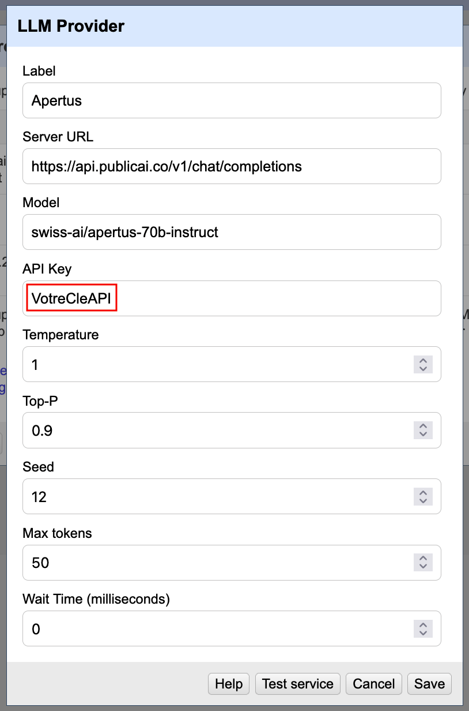

# Exercices

## Partie 1 : APIs

Les exercices sont basés sur le jeu de données [archives-privees-bibliotheque-de-geneve.csv](https://github.com/liowalter/open-refine-libreabc2025/blob/main/data/archives-privees-bibliotheque-de-geneve.csv). Il représente les fonds d'archives qui sont disponibles sur https://archives.bge-geneve.ch/archive/catalogue/categoriefonds/personnes-et-familles/n:90.

Pour chaque exercice, essayer d'abord sur les 10 premiers résultats pour ne pas surcharger les APIs (en mettant des étoiles puis en faisant [facet by star](https://librarycarpentry.github.io/lc-open-refine/13-looking-up-data.html#looking-up-data-from-a-url))


### Exercice 1.1 Reconciliation Wikidata :hot_pepper:

Récupérer le lieu de naissance ([P19](https://www.wikidata.org/wiki/Property:P19)) et le lieu décès ([P20](https://www.wikidata.org/wiki/Property:P20)) depuis Wikidata avec le service de Réconciliation (nom seulement, sans les dates de naissance) pour toutes les personnes mentionnées dans le jeu de données. 

- Exemple personne sur Wikidata : https://www.wikidata.org/wiki/Q464376
- Documentation : https://openrefine.org/docs/manual/reconciling 
- Video : https://www.youtube.com/watch?v=TPiOXiX1AoI

### Exercice 1.2 API GND :hot_pepper: :hot_pepper:

Récupérer le lieu de naissance (placeOfBirth) et décès (placeOfDeath) depuis l'API GND Lobid.

- Exemple personne sur Lobid GND : https://lobid.org/gnd/119081288
- Doc API : https://lobid.org/gnd/api 
- Url à utiliser : https://lobid.org/gnd/search?q=Maillart,+Ella&format=json

<details>
  <summary>Voir une solution possible...</summary>
  
  ```
  value.parseJson().member[0].placeOfBirth[0].label
  value.parseJson().member[0].placeOfDeath[0].label
  ```

</details>


### Exercice 1.3 Récupérer la profession via l'API GND :hot_pepper: :hot_pepper:

Récupérer la première profession (professionOrOccupation)

<details>
  <summary>Voir une solution possible...</summary>
  
  ```
  value.parseJson().member[0].professionOrOccupation[0].label
  ```

</details>

### Exercice 1.4 Enrichissement web :hot_pepper: :hot_pepper: :hot_pepper: :hot_pepper: 

A partir de l'URL vers le site de la BGE, dernière colonne, récupérer la "Présentation du producteur" depuis le web.

- Doc sur la syntaxe https://jsoup.org/cookbook/extracting-data/selector-syntax

<details>
  <summary>Voir une solution possible...</summary>
  Après la récupération du html, il faut extraire le noeud html suivant
  
  ```html
    <li class="descrip_sous_titre">
        <h6>Présentation du producteur</h6>
        <div class="">
            <p class="arc_firstp">Fille de Paul Maillart et de Dagmar Marie [...]</p>
        </div>
    </li>
  ```

  On y arrive en utilisant 

  ```
  value.parseHtml().select("li.descrip_sous_titre:contains(Présentation du producteur) p")[0].htmlText()
  ```

</details>

### Exercice 1.5 Tenir compte des dates de naissance :hot_pepper: :hot_pepper: :hot_pepper:

Refaire les exercies 1.1 à 1.3 en tenant compte des années de naissance
- Url GND https://lobid.org/gnd/search?q=Maillart,+Ella+AND+dateOfBirth%3A1903*+AND+dateOfDeath%3A1997*&format=json

Y a-t-il une différence dans les résultats ?


## Partie 2 : IA

Pour les exercices suivants, partir de la colonne qui contient les données "Présentation du producteur" extraites
à partir des pages de la Bibliothèque de Genève lors de la première partie (exercice 1.5).

À défaut, importer les données du fichier [`archives-privees-bibliotheque-de-geneve-enrichies.csv`](data/archives-privees-bibliotheque-de-geneve-enrichies.csv)
dans un nouveau projet OpenRefine et utiliser la colonne `PresentationProducteur`.

### Ajouter un modèle d'IA à OpenRefine :hot_pepper:

* Vérifier que l'extension [AI Extension for OpenRefine](https://github.com/sunilnatraj/llm-extension) est bien installée
* Ajouter au moins un modèle à choix, soit via une API externe, soit via l'API interne d'Ollama.

<details>
  <summary>Voir quelques exemples de configuration...</summary>
  
#### Mistral via l'API d'Infomaniak:
  

  
#### Apertus via l'API de PublicAI



#### Ollama en local:
  
  
  
  Pour voir la liste des modèles disponibles, taper `ollama list` dans un terminal. Pour installer un nouveau modèle, il suffit de le lancer avec p.ex. `ollama run llama3.2`. Cela donne quelque chose comme
  
  ```
  NAME                  ID              SIZE      MODIFIED    
  deepseek-r1:latest    6995872bfe4c    5.2 GB    3 weeks ago    
  deepseek-r1:8b        6995872bfe4c    5.2 GB    3 weeks ago    
  llama3.2:latest       a80c4f17acd5    2.0 GB    3 weeks ago
  ```
  
  Utilisez le nom du modèle tel qu'affiché dans la première colonne dans le menu de configuration.
  
  Noter que le bouton "Test service" ne fonctionne souvent pas!
</details>

### Extraire le lieu de naissance et le lieu de mort des producteurs :hot_pepper:

Utiliser l'extension AI pour extraire ces informations du bloc de texte "Présentation du producteur".

Quelques conseils:

* Sélectionnez quelques lignes du fichier avec la fonction "étoile" puis "Facet by star" pour tester sur un petit nombre de cas.
* Utiliser la fonction "Generate Preview" pour tester la réponse de l'IA et adapter votre consigne en conséquence!
* Certains modèles sont du genre plutôt verbeux... modifiez votre consigne pour les limiter au lieu uniquement!

<details>
  <summary>Voir un exemple de solution...</summary>
  
  La consigne suivante peut fonctionner avec Llama3.2:
  
  ```
  Donne-moi le lieu de naissance de cette personne ou si c'est une famille, son lieu ou sa région d'origine. Juste le lieu, sans autre information.
  ```
  
</details>

### Générer une courte description pour Wikidata de chaque producteur :hot_pepper: :hot_pepper:

Utiliser l'extension AI pour convertir la "Présentation du producteur" en une courte description conforme
[aux standards Wikidata](https://www.wikidata.org/wiki/Help:Description/fr).

Quelques conseils:

* Soyez très clairs sur les règles à suivre.
* Utilisez des intitulés pour indiquer la consigne, les règles à suivre, le format de résultat attendu.
* Utilisez des exemples de ce que vous voulez et ne voulez pas.
* Il peut être utile de souligner certaines règles en indiquant qu'un certain type de résultat est "invalide".
* Si les résultats ne sont pas conculants, essayez de modifier les paramètres du modèle (température, etc.) ou de changer de modèle.

<details>
  <summary>Voir un exemple de solution...</summary>
  
  La consigne suivante peut fonctionner avec Mistral:
  
  ```
  You are writing a very short description in French.

  ### Rules ###

  - length: maximum 6 words
  - first word: lowercase, not an article
  - do not repeat the person’s name
  - mention nationality or origin
  - focus only on what they are known for, what they did and not where they lived or who their parents were
  - ignore any mention of parents

  ### Output format ###
  A single line containing only the description, with no extra punctuation or commentary.

  ### Do not output ###

  Suisse française expatriée philosophe (mixes nationalities and focus on nationality instead of work
  Écrivaine et voyageuse française (starts with a capital letter)

  ### Do output like ###

  aventurière et philosophe suisse
  écrivain irlandais
  homme politique polonais

  The first word MUST NOT contain any capital letter. If you output a capital letter at the start, the answer is INVALID.
  ```
  
</details>

### Générer des informations structurées en JSON :hot_pepper: :hot_pepper: :hot_pepper:

Utiliser l'extension AI pour combiner les informations extraites aux étapes précédentes en un seul bloc de données
structurées au format JSON.

Quelques conseils:

* L'option "Provide JSON format" ne fonctionne pas avec tous les modèles. Il est souvent préférable d'indiquer le format de réponse désiré dans la consigne.
* Si la réponse apparaît tronquée, vérifiez que la taille de réponse spécifiée dans les paramètres (number of tokens) est suffisante.
* Essayez d'extraire les informations directement de l'URL et laissez l'IA tenter d'extraire les informations pertinentes!

<details>
  <summary>Voir des exemples de solution...</summary>
  
  Les consignes suivantes peuvent fonctionner avec Mistral:
  
  ```
You are extracting the places of birth and death of this person and writing a very short description in English and French.

### Rules for the description ###

- length: maximum 6 words
- first word: lowercase, not an article
- do not repeat the person’s name
- mention nationality or origin
- focus only on what they are known for, what they did and not where they lived or who their parents were
- ignore any mention of parents

### Output format ###
Use the following JSON template to format your output.
Only output the required schema, with no extra punctuation or commentary.
{
  "placeofbirth" : "place of birth",
  "placeofdeath" : "place of death",
  "description": [
    {
      "lang": "en",
      "text": "English description"
    },
    {
      "lang": "fr",
      "text": "French description"
    }
  ]
}

### Do not output ###

Suisse française expatriée philosophe (mixes nationalities and focus on nationality instead of work
Écrivaine et voyageuse française (starts with a capital letter)

### Do output like ###

aventurière et philosophe suisse
écrivain irlandais
homme politique polonais

The first word MUST NOT contain any capital letter. If you output a capital letter at the start, the answer is INVALID.
  ```
  
  ou directement depuis l'URL:
  
  ```
  From this URL, extract the information present in the section titled "Présentation du producteur".

  ### Output format ###
  Use the following JSON template to format your output.
  Only output the required schema, with no extra punctuation or commentary.
  {
    "type" : "family or person"
    "fathername" : "name of father",
    "mothername" : "name of mother",
    "dateofbirth" : "date of birth",
    "dateofdeath" : "date of death"
    "placeofbirth" : "place of birth",
    "placeofdeath" : "place of death"
  }
  ```
</details>
