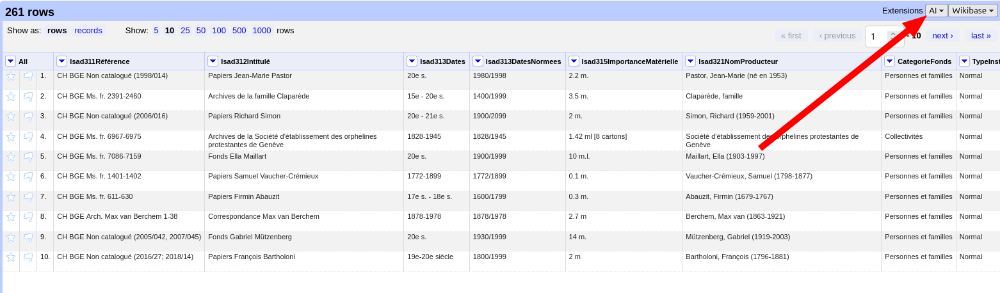

# Aller plus loin avec OpenRefine : API, intelligence artificielle et outils avancés

Dans le cadre de la [journée LibreABC](https://libreabc.ch), 9 septembre 2025, Genève.

## Résumé de l'atelier

Le logiciel open source OpenRefine offre une panoplie d’outils puissants pour nettoyer et explorer des données. Savez-vous qu’il est possible de faire appel à des services externes (via une API) pour aller encore plus loin ? Dans cet atelier, nous utiliserons un service d’intelligence artificielle pour extraire et structurer des informations à partir de données non structurées. Vous verrez ainsi comment configurer et utiliser une API depuis OpenRefine pour effectuer des opérations avancées et récupérer des données externes. L’atelier inclut des exercices pratiques basés sur un jeu de données complexe et laisse place à l’expérimentation individuelle. Venez découvrir des techniques puissantes pour enrichir vos données en un rien de temps.

### Intervenants

Thomas Guignard, consultant en technologie de bibliothèque et données ouvertes, [TG Consulting](https://tgconsulting.ca/)
Lionel Walter, ingénieur logiciel spécialisé en bibliothèques et archives, [arbim IT](https://arbim.ch/)

## Prérequis

Si possible, merci de procéder aux étapes suivantes avant l'atelier.

### Essentiel

- Installer [OpenRefine 3.9.3](https://openrefine.org/download)
- Installer l'extension [AI Extension for OpenRefine](https://github.com/sunilnatraj/llm-extension) (testé avec la version 0.1.2.3). En cas de besoin, se référer à la [documentation OpenRefine sur l'installation des extensions](https://openrefine.org/docs/manual/installing#installing-extensions). Pour vérifier que cela a fonctionné, l'option "AI" doit apparaître en haut de la fenêtre OpenRefine : 

- Télécharger les [jeux de données disponibles](https://github.com/liowalter/open-refine-libreabc2025/tree/main/data)

### Optionnel

- Créer un compte chez Infomaniak et [activer le test gratuit permettant de bénéficier de 1M](https://www.infomaniak.com/fr/hebergement/ai-tools) de crédits offerts pour l'utilisation d'IA souveraines et "open source"
- Si votre institution ou vous-même bénéficiez d'un outil IA de type ChatGPT, essayez de trouver la clé API vous permettant d'utiliser ces services directement en mode machine (par exemple avec ChatGPT cela se passe sur https://platform.openai.com/api-keys)
- Installer le logiciel [Ollama](https://ollama.com/) qui permet de faire tourner des modèles IA sur votre propre machine. 
