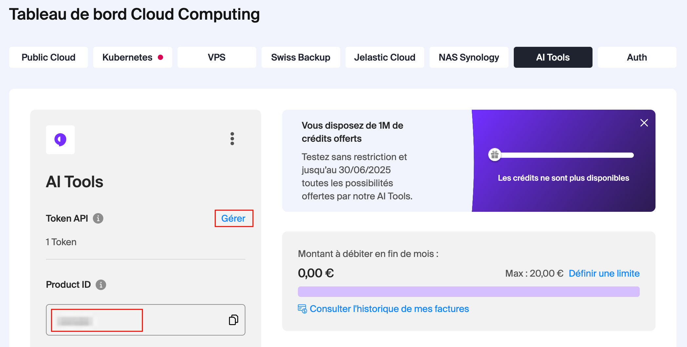

# Aller plus loin avec OpenRefine : API, intelligence artificielle et outils avancés

Dans le cadre de la [journée LibreABC](https://libreabc.ch), 9 septembre 2025, Genève.

## Résumé de l'atelier

Le logiciel open source OpenRefine offre une panoplie d’outils puissants pour nettoyer et explorer des données. Savez-vous qu’il est possible de faire appel à des services externes (via une API) pour aller encore plus loin ? Dans cet atelier, nous utiliserons un service d’intelligence artificielle pour extraire et structurer des informations à partir de données non structurées. Vous verrez ainsi comment configurer et utiliser une API depuis OpenRefine pour effectuer des opérations avancées et récupérer des données externes. L’atelier inclut des exercices pratiques basés sur un jeu de données complexe et laisse place à l’expérimentation individuelle. Venez découvrir des techniques puissantes pour enrichir vos données en un rien de temps.

### Intervenants

- Thomas Guignard, consultant en technologie de bibliothèque et données ouvertes, [TG Consulting](https://tgconsulting.ca/)
- Lionel Walter, ingénieur logiciel spécialisé en bibliothèques et archives, [arbim IT](https://arbim.ch/)

## Prérequis

Si possible, merci de procéder aux étapes suivantes avant l'atelier.

### Essentiel

- Installer [OpenRefine 3.9.3](https://openrefine.org/download)
- Installer l'extension [AI Extension for OpenRefine](https://github.com/sunilnatraj/llm-extension) (testé avec la version 0.1.2.3). En cas de besoin, se référer à la [documentation OpenRefine sur l'installation des extensions](https://openrefine.org/docs/manual/installing#installing-extensions). Pour vérifier que cela a fonctionné, l'option "AI" doit apparaître en haut de la fenêtre OpenRefine : 

- Télécharger les [jeux de données disponibles](https://github.com/liowalter/open-refine-libreabc2025/tree/main/data)

### Optionnel

Une clé API sera fournie lors de l'atelier pour vous permettre d'effectuer quelques requêtes auprès d'une IA.
Cependant, nous vous conseillons d'obtenir votre propre clé pour vous permettre de continuer à l'utiliser après l'atelier.

Voici quelques options (du plus simple au plus complexe):

#### 1. Utiliser une IA hébergée en Suisse par Infomaniak (test gratuit)
Cette option permet d'utiliser plusieurs modèles d'IA performants et "ouverts" hébergés en Suisse chez Infomaniak.
C'est un bon compromis entre performance et respect de la vie privée (les données restent en Suisse).

L'utilisation des IA d'Infomaniak est payante, mais il est possible d'[activer un test gratuit permettant de bénéficier de 1M](https://www.infomaniak.com/fr/hebergement/ai-tools) de crédits. 

Les informations suivantes seront ensuite nécessaires pour utiliser votre compte Infomaniak depuis OpenRefine:
- Votre **Product ID**
- Une clé **token API**

Vous trouverez voutre **Product ID** dans le tableau de bord Infomaniak, onglet "AI Tools":

Pour créer un "token API", cliquez sur le lien "Gérer" de votre tableau de bord et créez une nouvelle clé
en choisissant **ai-tools** dans le menu "Scopes":

Copiez la clé ainsi générée dans un document texte par exemple, vous en aurez besoin pour configurer l'extension et
elle ne s'affichera plus une fois la fenêtre fermée.

#### 2. Utiliser une IA propriétaire (payant)
Si votre institution ou vous-même bénéficiez d'un accès à un outil IA de type ChatGPT, Copilot, etc. essayez d'obtenir une clé API vous permettant d'utiliser ces services directement en mode machine (par exemple avec ChatGPT cela se passe sur https://platform.openai.com/api-keys). C'est l'option la plus simple et la plus performante, mais payante et les données seront envoyées aux serveurs d'OpenAI hors de Suisse.

#### 3. Utiliser un modèle en local sur votre machine (gratuit)
Installer le logiciel [Ollama](https://ollama.com/) qui permet de faire tourner des modèles IA sur votre propre machine.
Cette option est entièrement gratuite et toutes les données transmises au modèle resteront sur votre ordinateur.
Cependant, la qualité du résultat et la vitesse de réponse dépendront de la puissance de votre processeur.

**Important** si vous voulez utiliser Ollama lors de l'atelier, chargez le modèle llama3.2 sur votre machine avant l'atelier (cela prend du temps à télécharger).

Dans le terminal/ligne de commande, tapez `ollama run llama3.2` pour initier ce processus.

Alternativement, vous pouvez rechercher le modèle `llama3.2` dans le menu déroulant de l'application ollama
(depuis la version 0.10.0 sur Mac et Windows)
et cliquer sur la petite flèche pour télécharger le modèle sur votre machine:

Vous pouvez aussi chosir un autre modèle, mais pour pouvoir fonctionner avec l'extention OpenRefine, il doit offrir une API de type `/chat/completions`.
